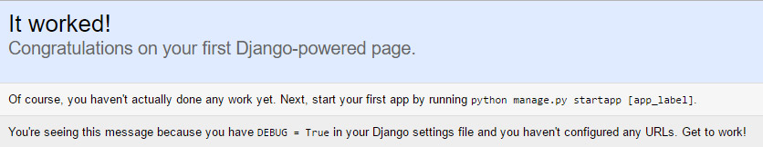
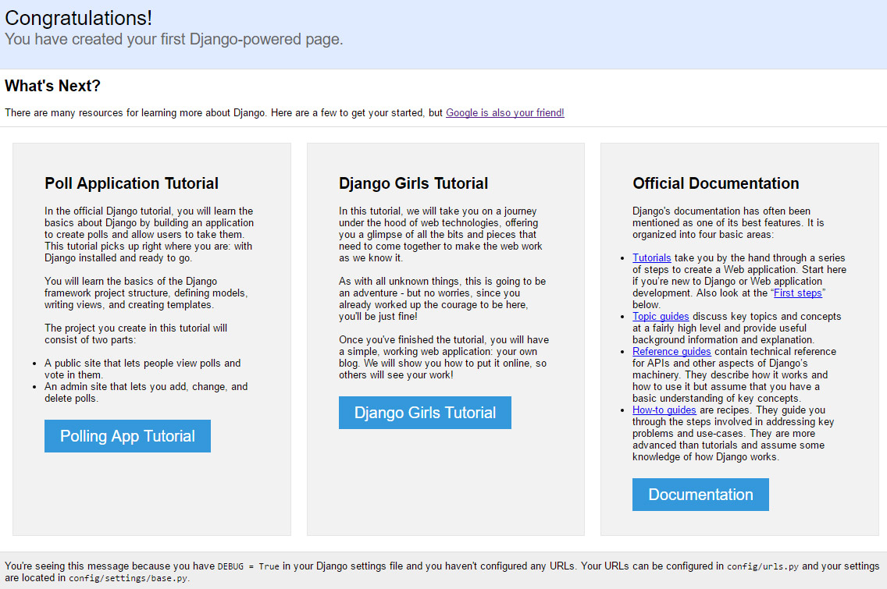

# DEP XXX: Django default Project Enhancements

* DEP: XXX
* Author: Timothy Allen
* Implementation Team: Timothy Allen, TBA
* Shepherd: TBA
* Status: Draft
* Type: Feature
* Created: 2017-02-20
* Last-Modified: 2017-02-20

## Abstract

This DEP describes several enhancements which could be made to the default Django Project created when the `startproject` command is run. The goal is to maintain the simplicity of the initial project, while removing several pain points for newcomers and taking advantage of several opportunities to give direction for learning.

We would plan for this to become to become the default project created with the `startproject` command.

## Background and Motivation

Over the past few years, I have had the opportunity to introduce Django to over a hundred people. Some of these people have been experienced developers, some have been brand new to coding, with the full spectrum of experience levels in between. This has shown patterns and pain points that the default Django Project could be modified to remove, making Django more accessible to the newcomer.

There are three main pain points which have been revealed:

* Confusion over project settings versus Django apps
* Opportunities for providing learning through introspection
* Confusion created by providing a project that lacks many conventions used in a production project
* Answering the question after "It Worked!": "What's Next?"

This project would include rewriting the documenation where necessary, and notifying (and working with) maintainers of third-party tutorials.

## Specification

Here are functional specifications for what we would recommend changing.

### Configuration Directory Convention

Currently, Django creates a configuration sub-directory with the same name given to the project. For example, this command will create the following directory structure for configuration files:

    django-admin startproject myproject

```
+ myproject/
+ myproject/manage.py
+--- myproject/
+--- myproject/settings.py
+--- app1/
+--- app2/
```

This is a source of confusion for the majority of new Djangonauts. Let's pick a convention and stick with it, a `config` directory:

```
+ myproject/
+ myproject/manage.py
+--- config/
+--- config/settings/
+--- config/settings/base.py
+--- requirements/
+--- requirements/base.txt
+--- app1/
+--- app2/
```

This has several advantages. First, configuration files will always be in a `config` subdirectory, with a settings subdirectory underneath it. Explaining to newcomers that the `config.urls` is the root of your URLs has made a lot more sense to newcomers since I have started using this project layout. While requirements files aren't necessarily part of a first time experience, it gives an opportunity for learning by introspection as well.

### Valuable Real Estate: The "It Worked!" page

After successfully starting a Django project and bringing it up in the browser, the new Django user is greeted with this page:



While it gives a nice instruction on starting a Django app, this seems like a huge missed opportunity to point a new Djangonaut towards one of the many vibrant Django tutorials available. Image if we provided the newcomer with something like this instead:



## Documentation

## Implementation tasks

The following independant tasks can be identified:

* Convert the project created with the `djangoadmin startproject` command to reflect the new default project structure.
* Update the Django documentation.
* Identify affected third party tutorials and notify their maintainers.
* Choose sites to highlight in "What's Next" section of the "It Worked!" page.
